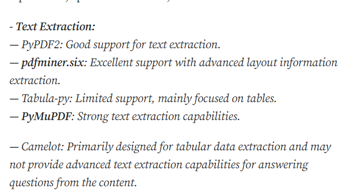
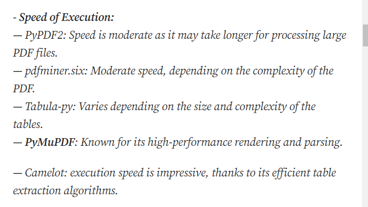

- speechrecognition and pydub https://blog.devgenius.io/how-to-transcribe-a-video-with-97-accuracy-using-python-f59bbf71d640
- speechrecognition and moviepy https://www.geeksforgeeks.org/extract-speech-text-from-video-in-python/
- whisper, langdetect.detect, pytube.YouTube https://github.com/javedali99/audio-to-text-transcription
- wave, math, contextlib, speech_recognition, moviepy.editor https://towardsdatascience.com/transcribing-interview-data-from-video-to-text-with-python-5cdb6689eea1
- recognize_bing(), recognize_wit() and recognize_google_cloud() can also be used
- vosk API https://github.com/adhikary97/Sharetape-Speech-To-Text/tree/main
- https://lablab.ai/t/whisper-tutorial whisper 
- https://indiaai.gov.in/article/speech-to-text-with-openai-s-whisper
- https://towardsdatascience.com/speech-to-text-with-openais-whisper-53d5cea9005e

- Keep in mind the file size (media time restriction of sending the inputs to APIs). -- 1 min for most
- check out api/library to check correctness of parsed text

PDF : LOOK AT THESE WHILE MAKING REPORT
- https://pradeepundefned.medium.com/a-comparison-of-python-libraries-for-pdf-data-extraction-for-text-images-and-tables-c75e5dbcfef8
- https://github.com/py-pdf/benchmarks/tree/main/read
- https://stackoverflow.com/questions/34837707/how-to-extract-text-from-a-pdf-file

